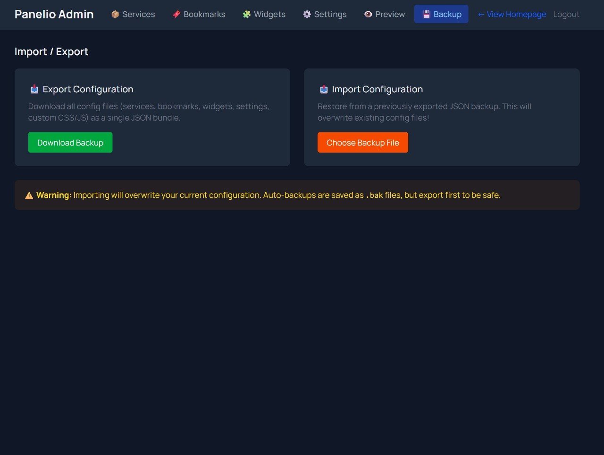
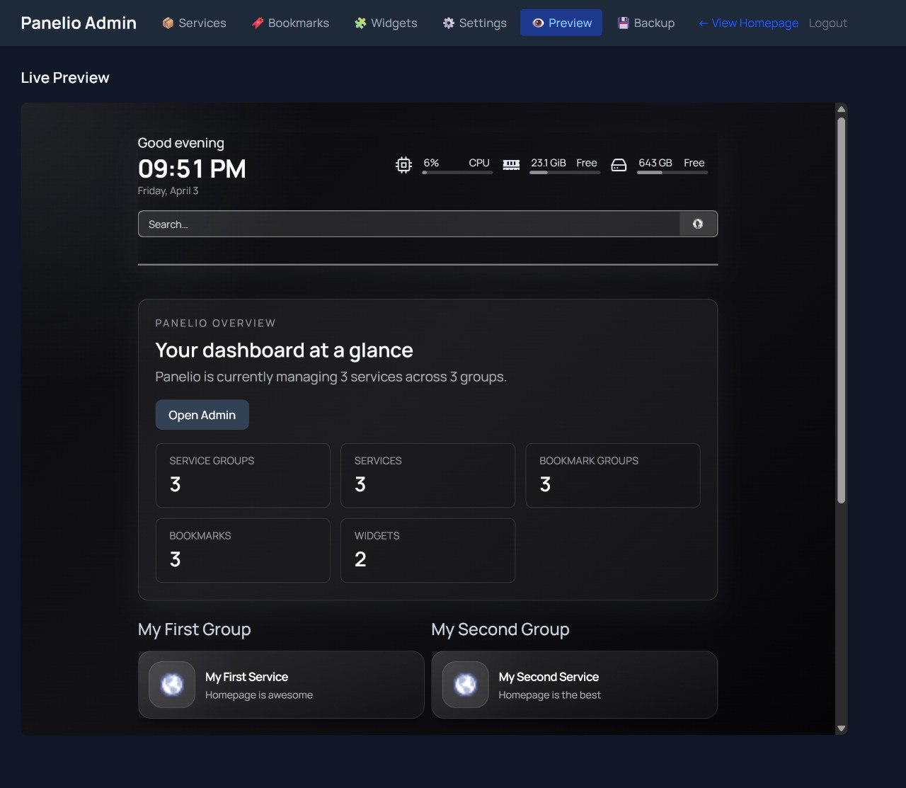
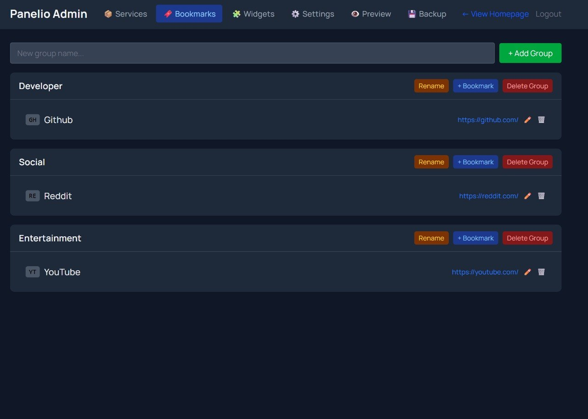
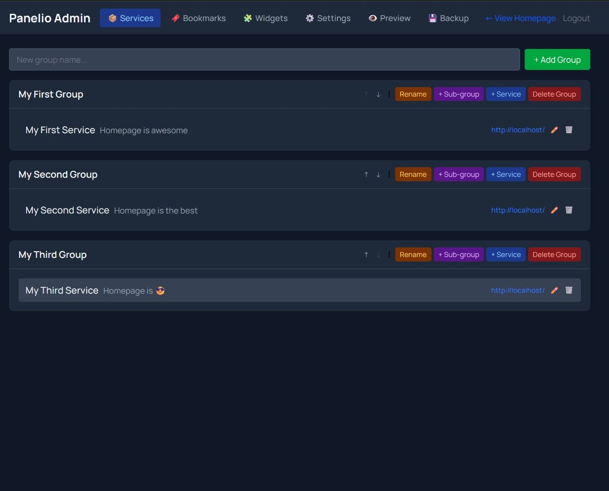
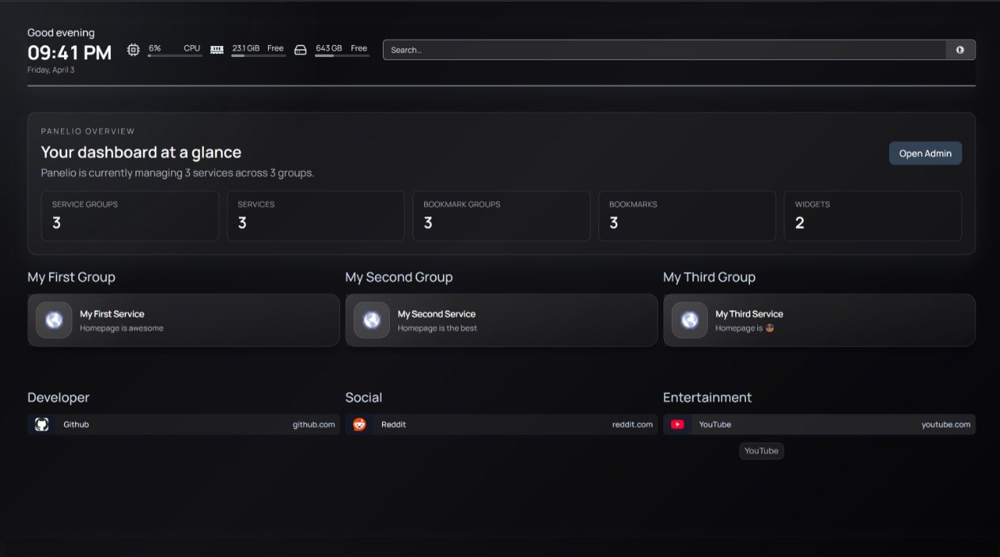
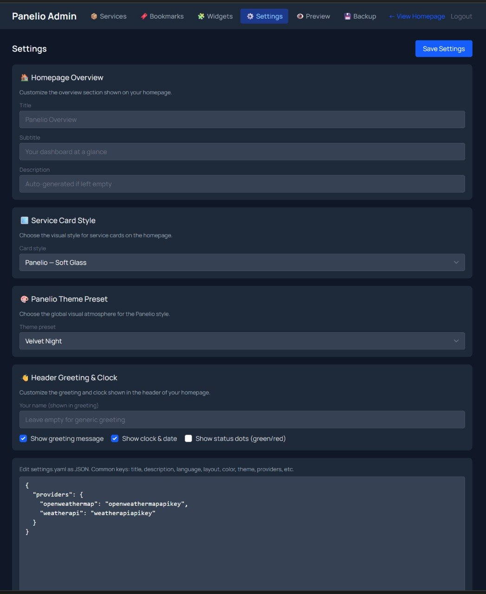

<p align="center">
  
  
  
  
  
</p>

# Panelio

Panelio is a self-hosted dashboard with a built-in admin UI.

It starts from the solid base of [Homepage](https://github.com/gethomepage/homepage) and adds a full web configuration layer, so you can manage your dashboard from the browser instead of editing YAML files by hand.

- **Website:** [panelio.vellis.cc](https://panelio.vellis.cc)
- **Live demo:** [demo-panelio.vellis.cc](https://demo-panelio.vellis.cc) _(password: `demo`)_
- **Docker image:** `ghcr.io/vellis59/panelio:latest`

## Why Panelio

Panelio is for people who like the Homepage ecosystem, but want a smoother day-to-day experience.

With Panelio, you can:

- manage services, bookmarks, widgets, and settings from the browser
- keep using simple files in `config/`
- run it with Docker or locally
- stay in control without adding a database or a heavy backend

## Features

- 🖥️ **Built-in admin panel** — manage services, bookmarks, widgets, and settings visually
- 🔐 **Password-protected admin** — simple single-user protection for `/admin`
- 💾 **Import / export** — back up or restore your full configuration in one click
- 🟢 **Status dots** — see service health directly on cards
- ⭐ **Favorites bar** — pin important services to the top
- 🎨 **Theme controls** — tweak the look without digging through files
- 📱 **Responsive layout** — usable on desktop and mobile
- 🐳 **Docker-friendly** — ready for self-hosted deployments

## Quick Start

If you just want to try Panelio quickly, this is the fastest path.

### Run the demo locally in 5 steps

1. **Clone the repository**
2. **Install dependencies**
3. **Copy the example config**
4. **Set your local environment variables**
5. **Start the app**

```bash
git clone https://github.com/Vellis59/panelio.git
cd panelio
pnpm install
cp -r deploy/config ./config
HOMEPAGE_ALLOWED_HOSTS=localhost PANELIO_ADMIN_PASSWORD=changeme pnpm dev
```

Then open:

- `http://localhost:3000` — dashboard
- `http://localhost:3000/admin` — admin panel

### Run with Docker

```bash
docker pull ghcr.io/vellis59/panelio:latest
curl -O https://raw.githubusercontent.com/Vellis59/panelio/main/deploy/docker-compose.yml
docker compose up -d
```

Then open:

- `http://localhost:3011` — dashboard
- `http://localhost:3011/admin` — admin panel

## Deployment Notes

### EasyPanel / Coolify / other PaaS tools

To deploy Panelio on a platform:

1. Point the service to `https://github.com/Vellis59/panelio.git`
2. Use the branch you want to deploy (`dev` for testing, `main` for stable releases)
3. Mount a persistent volume at `/app/config`
4. Expose port `3000`
5. Add the required environment variables

### Required environment variables

| Variable | Required | Description |
| --- | --- | --- |
| `HOMEPAGE_ALLOWED_HOSTS` | Yes | Allowed hostnames, for example `panelio.example.com` or `localhost` |
| `PANELIO_ADMIN_PASSWORD` | Recommended | Password used to protect `/admin` |
| `PUID` / `PGID` | Optional | User and group IDs, default `1000` |

## What the admin panel can do

Once logged in to `/admin`, you can:

- add, edit, reorder, and delete **services** and **groups**
- manage **bookmarks**
- configure **widgets**
- change **settings** such as theme, greeting, card style, and display options
- **import** and **export** the full configuration bundle

## Configuration Files

All runtime configuration lives in `config/`.

```text
config/
├── services.yaml    # Services and groups
├── bookmarks.yaml   # Quick links
├── widgets.yaml     # Integrations
└── settings.yaml    # Theme and display preferences
```

A small example:

```yaml
- Media:
    - Jellyfin:
        href: http://localhost:8096
        description: Movies and shows
```

You can still edit files manually if you want, but Panelio is designed to reduce how often you need to.

## Screenshots

### Dashboard





### Visual styles and status







### Admin panel



## Development

Useful local commands:

```bash
pnpm install
pnpm dev
pnpm build
pnpm test
pnpm test:coverage
```

If you want to contribute, please read [CONTRIBUTING.md](./CONTRIBUTING.md).

## Acknowledgements

Panelio is built on top of [Homepage](https://github.com/gethomepage/homepage) by [benphelps](https://github.com/benphelps).

This project keeps the file-based spirit of Homepage while pushing further toward a smoother admin experience for self-hosters.

## License

This repository is currently distributed under the [GPL-3.0 license](./LICENSE).
